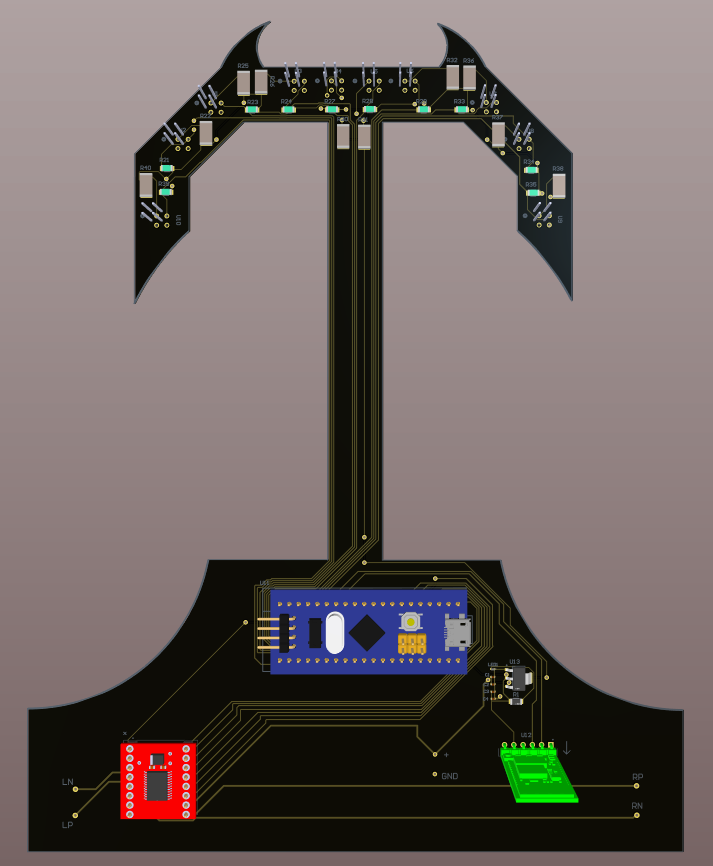
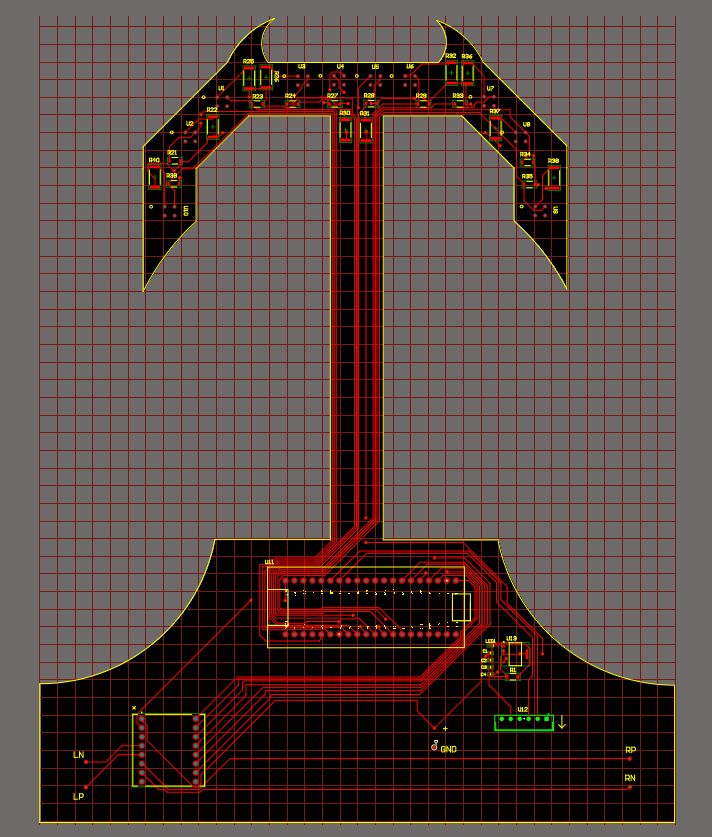
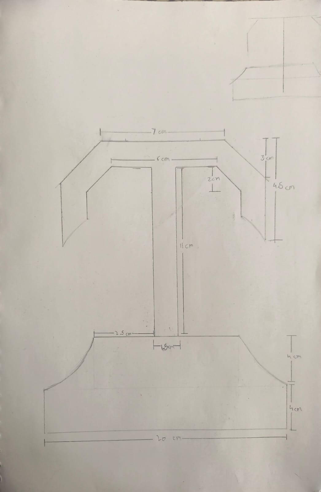

# Line Follower

An ESP32-based line-following robot with a custom PCB, 8-channel IR sensor array, and PID-based motor control — tunable live over Wi-Fi from a browser dashboard.



## Overview

The robot uses an 8-sensor IR array to detect a line, computes a weighted line position, and drives two motors through a TB6612-style driver using a PID control loop. The ESP32 hosts its own Wi-Fi access point and a lightweight web server, so PID gains, speeds, and calibration can all be adjusted from a phone or laptop browser — no re-flashing required.

## Features

- 8-channel IR sensor array with automatic min/max calibration
- Weighted line-position calculation with line-lost recovery behavior
- PID motor control (tunable `Kp`, `Ki`, `Kd`, base/turn/max speed)
- ESP32 Wi-Fi Access Point + HTTP server for live control and telemetry
- Browser-based dashboards for sensor visualization and PID tuning
- Custom Altium PCB design with 3D/STEP models
- Standalone test sketches for motors and sensors

## Repository Structure

```
Line-Follower/
├── Software/
│   ├── PID_Code.ino                       # Main firmware — sensing, PID, Wi-Fi control server
│   ├── Motor_test_code.ino                # Standalone motor driver test
│   ├── Sensor_test_code.ino               # Standalone IR sensor calibration/test
│   ├── PID_Tuning_with_dashboard.html     # Browser dashboard for live PID tuning
│   └── Sensor_test_dashboard.html         # Browser dashboard for sensor visualization
└── Hardware/
    └── PCB/
        ├── Altium/                        # Altium schematic and PCB source files
        ├── STEP/                          # 3D STEP model of the PCB
        └── Image/                         # PCB renders and sketches
```

## Hardware

- **MCU:** ESP32
- **Sensors:** 8x analog IR reflectance sensors
- **Motor driver:** Dual H-bridge (TB6612/DRV8833-style), PWM speed control
- **PCB:** Custom-designed in Altium Designer (schematic, layout, and 3D/STEP export included)

| PCB Layout | Sketch |
|---|---|
|  |  |

Altium project files are under `Hardware/PCB/Altium/`. Open `Line Follower.PrjPcbStructure` in Altium Designer to view the schematic (`Sheet1.SchDoc`, `Sheet2.SchDoc`) and board (`PCB1.PcbDoc`). A 3D model is available at `Hardware/PCB/STEP/PCB1.step` for mechanical CAD/enclosure work.

> **Note:** Pin mappings differ slightly between `Motor_test_code.ino`/`Sensor_test_code.ino` and `PID_Code.ino`. Confirm wiring against the pin `#define`s at the top of whichever sketch you flash.

## Getting Started

### 1. Flash the firmware

1. Open the desired `.ino` file in the Arduino IDE (with ESP32 board support installed) or PlatformIO.
2. Select your ESP32 board and port.
3. Upload:
   - `Sensor_test_code.ino` to verify sensor readings and calibration first.
   - `Motor_test_code.ino` to verify motor direction and speed.
   - `PID_Code.ino` for full autonomous line-following.

### 2. Calibrate the sensors

On boot, `PID_Code.ino` runs a 3-second automatic calibration — sweep the sensor array across the line and off it so each sensor sees both its minimum and maximum reflectance. The onboard LED blinks during calibration.

### 3. Connect to the robot

The robot starts a Wi-Fi access point:

- **SSID:** `ESP32-LineFollower`
- **Password:** `12345678`
- **IP:** `192.168.4.1`

Connect a phone or laptop to this network, then open `PID_Tuning_with_dashboard.html` or `Sensor_test_dashboard.html` in a browser to view live telemetry and adjust parameters.

### 4. Tune and run

From the PID tuning dashboard you can adjust `Kp`, `Ki`, `Kd`, base speed, turn speed, and max speed in real time, then send `start` to begin line following and `stop` to halt.

## HTTP API

`PID_Code.ino` exposes a simple HTTP interface on port 80:

| Endpoint | Method | Description |
|---|---|---|
| `/cmd?value=<command>` | GET | Send a command (see below) |
| `/status` | GET | Returns current state as JSON |
| `/packet` | GET | Returns the latest telemetry packet |

**Commands** (via `/cmd?value=`):

| Command | Effect |
|---|---|
| `start` | Enable line following |
| `stop` | Disable and stop motors |
| `cal` | Re-run sensor calibration |
| `Kp=<float>` | Set proportional gain |
| `Ki=<float>` | Set integral gain |
| `Kd=<float>` | Set derivative gain |
| `base=<int>` | Set base motor speed |
| `turn=<int>` | Set turning speed offset |
| `max=<int>` | Set max motor speed |

## License

No license specified yet. Add a `LICENSE` file to define usage terms for this repository.
